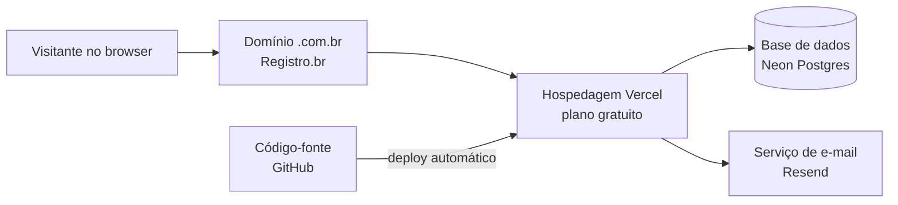

# Documento de entrega — Site institucional  
**Julio Capetini e Advogado associado**

> **Versão:** 1.0 · **Data:** ___/___/2026  
> **Elaborado por:** _________________________  
> **Destinatário:** Escritório / responsável pela contratação  

Este documento resume o que foi entregue, como o site funciona no dia a dia, onde ficam as contas de serviço e quais são as **limitações dos planos gratuitos** utilizados. Serve tanto para referência do escritório quanto para um profissional de TI que venha a fazer manutenção no futuro.

---

## 1. Resumo em linguagem simples

Foi desenvolvido um **site institucional** (página profissional na internet) para apresentar o escritório, a equipa, as áreas de atuação e formas de contacto. O visitante pode:

- Conhecer o escritório na **página inicial**;
- Enviar mensagem pelo **formulário de contacto** (a mensagem chega por e-mail à caixa configurada pelo escritório);
- Ler **artigos** publicados em `/artigos` (conteúdo jurídico ou informativo);
- Contactar por **telefone, WhatsApp e e-mail**, conforme os dados exibidos no site.

A **gestão de artigos** e de **utilizadores administradores** é feita numa área reservada, acessível apenas com login e palavra-passe, em endereços que começam por `/admin` (por exemplo: `/admin/login`).

O site **não substitui** software de gestão de processos, agenda jurídica, peticionamento eletrónico ou arquivo de clientes. É uma vitrine e canal de contacto e conteúdo.

---

## 2. O que o site inclui (funcionalidades)

| Área | Endereço (exemplo) | O que faz |
|------|-------------------|-----------|
| Página inicial | `/` | Apresentação, equipa, especialidades, atendimento e formulário de contacto |
| Artigos (público) | `/artigos` e `/artigos/nome-do-artigo` | Listagem e leitura de textos publicados |
| Login administrativo | `/admin/login` | Entrada da equipa autorizada |
| Gestão de artigos | `/admin/artigos` | Criar, editar e publicar artigos |
| Administradores | `/admin/admins` | Criar ou remover contas de quem pode aceder ao `/admin` |
| Recuperar senha | `/admin/esqueci-senha` | Envio de link por e-mail para redefinir palavra-passe |

**E-mails automáticos (via Resend):**

- Mensagens enviadas pelo formulário de contacto da página inicial;
- E-mails de recuperação de palavra-passe dos administradores.

**O que não está incluído (limitações de produto):**

- Alterar textos da página inicial (nomes, telefones, biografias da equipa, etc.) **pelo painel admin** — hoje isso exige editar o código do site e publicar de novo (trabalho de desenvolvedor);
- Área de clientes, upload de documentos de processos ou chat interno;
- Loja, pagamentos ou agendamento automático de consultas integrado;
- Newsletter ou campanhas de marketing em massa (o Resend gratuito é focado em e-mails transacionais, não em campanhas grandes).

---

## 3. Como o site “vive” na internet (visão geral)

1. O **domínio** foi registado no **Registro.br** e aponta para os servidores da **Vercel**.  
2. A **Vercel** executa o site e liga-se à **base de dados Neon** (onde ficam utilizadores admin e artigos).  
3. O **Resend** envia os e-mails do formulário e da recuperação de senha.  
4. O **código** está no **GitHub**; cada atualização aprovada pode gerar um novo deploy na Vercel.

**E-mail central das contas:** foi criada uma caixa no **Proton Mail** para concentrar logins e recuperação de acesso aos serviços (recomendado manter esta caixa ativa e com autenticação em dois fatores).

---

## 4. Serviços contratados (planos gratuitos)

| Serviço | Função | Plano utilizado | Observação |
|---------|--------|-----------------|------------|
| **Registro.br** | Domínio `.br` do site | Pago anualmente ao Registro.br | Renovação obrigatória; se expirar, o site deixa de abrir pelo domínio |
| **Vercel** | Hospedagem e publicação do site | Hobby (gratuito) | Deploy ligado ao repositório Git |
| **GitHub** | Armazenamento do código | Gratuito (conta indicada abaixo) | Histórico de alterações e colaboração técnica |
| **Neon** | Base de dados PostgreSQL | Free | Utilizadores admin + artigos |
| **Resend** | Envio de e-mails do site | Free | Formulário de contacto + reset de senha |
| **Proton Mail** | E-mail “mestre” das contas | Conforme plano escolhido | Não envia o site; só organiza acessos |

> **Importante:** Os limites abaixo são dos **planos gratuitos** e podem ser alterados pelos fornecedores. Convém rever o painel de cada serviço uma vez por ano ou antes de campanhas que aumentem muito o tráfego ou os e-mails.

---

## 5. Limitações dos planos gratuitos

### 5.1 Vercel (hospedagem)

| Limite (referência Hobby) | Impacto prático |
|---------------------------|-----------------|
| ~**100 GB/mês** de transferência (“bandwidth”) | Muitas visitas, imagens muito pesadas ou vídeos embutidos podem esgotar o mês; o projeto pode ser **pausado** até ao ciclo seguinte ou exigir upgrade |
| **1 milhão** de execuções de funções/mês | Normal para um site de escritório; picos anómalos (ataques, bots) podem consumir quota |
| **100 deploys/dia** | Só relevante se houver muitas publicações no mesmo dia |
| Uso **comercial** | A Vercel define regras de “fair use” no plano Hobby; sites comerciais de empresas costumam migrar para plano **Pro** (~US$ 20/mês) quando o tráfego ou as exigências de suporte aumentam — **validar nos termos atuais da Vercel** |

**Sintomas de limite atingido:** site lento, erro ao publicar, mensagem no painel Vercel a indicar quota excedida.

### 5.2 Neon (base de dados)

Valores anotados no projeto e alinhados à documentação pública do plano Free (confirmar no painel Neon):

| Recurso | Limite típico (Free) | Impacto prático |
|---------|----------------------|-----------------|
| Armazenamento | **~0,5 GB (500 MB)** por projeto | Muitos artigos muito longos ou dados extra no futuro podem encher o espaço |
| Compute | **100 CU-hours por projeto/mês** | A base “dorme” após inatividade (~5 min); o primeiro acesso após pausa pode demorar **alguns segundos** |
| Escala máxima | Até **2 CU (~8 GB RAM)** quando ativa | Suficiente para este site; picos extremos podem exigir plano pago |
| Egress (saída de rede) | **5 GB/mês** incluídos | Raro ser problema num site pequeno |

**Sintomas de limite atingido:** erro ao guardar artigo ou ao fazer login; painel Neon indica compute suspenso até ao mês seguinte ou upgrade.

### 5.3 Resend (e-mail)

| Limite (Free) | Impacto prático |
|---------------|-----------------|
| **3 000 e-mails/mês** | Formulário de contacto + recuperações de senha; campanhas em massa esgotam rápido |
| **100 e-mails/dia** | Dia com muitos contactos ou muitos resets pode bloquear envios até às 24 h |
| **1 domínio** verificado | O remetente (`noreply@...`) deve usar domínio configurado no Resend |
| Contagem | Cada destinatário em Para/CC/CCO conta como e-mail separado |

**Sintomas:** formulário devolve erro; e-mail de recuperação de senha não chega; painel Resend com quota esgotada.

### 5.4 Registro.br (domínio)

| Aspecto | Impacto prático |
|---------|-----------------|
| Renovação **anual** (ou prazo contratado) | Domínio expirado → site inacessível pelo endereço `.br` |
| DNS | Alterações de servidor devem ser feitas no Registro.br ou onde o DNS estiver delegado |
| WHOIS / titular | Manter dados de contacto atualizados para não perder o domínio |

### 5.5 GitHub

| Aspecto | Impacto prático |
|---------|-----------------|
| Repositório privado ou público | Definir quem tem acesso de leitura/escrita |
| Sem GitHub | Novo desenvolvedor precisa de cópia do código e acesso à Vercel/variáveis |

---

## 6. Contas e acessos (preencher e guardar em local seguro)

> **Segurança:** Não enviar este anexo por e-mail sem encriptação. Preferir **gestor de palavras-passe** (1Password, Bitwarden, etc.) partilhado só com responsáveis. Ativar **autenticação em dois fatores (2FA)** em todas as contas abaixo.

### 6.1 E-mail central (Proton Mail)

| Campo | Valor |
|-------|--------|
| Endereço | `___________________________` |
| Utilização | Login/recuperação das contas Vercel, GitHub, Neon, Resend, Registro.br |
| 2FA ativo? | ☐ Sim ☐ Não |

### 6.2 Registro.br (domínio)

| Campo | Valor |
|-------|--------|
| Domínio | `___________________________` |
| Titular / conta | `___________________________` |
| Login (CPF/CNPJ ou usuário) | `___________________________` |
| Data de renovação | `___/___/____` |
| DNS aponta para | Vercel (registos indicados no painel Vercel → Domains) |

### 6.3 Vercel (hospedagem)

| Campo | Valor |
|-------|--------|
| URL do projeto | `https://___________________` |
| Conta / equipa | `___________________________` |
| Repositório ligado | `___________________________` |
| Domínio de produção | `https://___________________` |

**Variáveis de ambiente** (configuradas em *Project → Settings → Environment Variables* — **não** estão no GitHub):

| Variável | Para quê |
|----------|----------|
| `POSTGRES_URL` | Ligação à base Neon |
| `AUTH_SECRET` | Segurança das sessões admin |
| `AUTH_URL` | URL pública do site (com `https://`) |
| `NEXT_PUBLIC_SITE_URL` | URL canónica (SEO, partilhas) |
| `RESEND_API_KEY` | Chave API Resend |
| `RESEND_FROM_EMAIL` | Remetente verificado |
| `CONTACT_TO_EMAIL` | Caixa que recebe o formulário |

### 6.4 GitHub (código)

| Campo | Valor |
|-------|--------|
| Organização / utilizador | `___________________________` |
| Repositório | `___________________________` |
| URL | `https://github.com/________________` |
| Colaboradores com acesso | `___________________________` |

### 6.5 Neon (base de dados)

| Campo | Valor |
|-------|--------|
| Projeto | `___________________________` |
| Região | `___________________________` |
| Connection string | Guardar só no gestor de senhas / Vercel env (`POSTGRES_URL`) |
| Painel | `https://console.neon.tech` |

### 6.6 Resend (e-mail transacional)

| Campo | Valor |
|-------|--------|
| Domínio verificado | `___________________________` |
| Remetente (`RESEND_FROM_EMAIL`) | `___________________________` |
| Destino do formulário (`CONTACT_TO_EMAIL`) | `___________________________` |
| API Key | Guardar só na Vercel / gestor de senhas |

### 6.7 Área administrativa do site

| Campo | Valor |
|-------|--------|
| URL de login | `https://___________/admin/login` |
| E-mail(s) admin inicial(is) | `___________________________` |
| Quem gere novos admins | Utilizadores já logados em `/admin/admins` |

**Recuperação de senha:** usar `/admin/esqueci-senha` (depende do Resend estar dentro dos limites).

---

## 7. Operação do dia a dia (para o escritório)

### Publicar ou editar um artigo

1. Aceder a `https://[seu-dominio]/admin/login`  
2. Iniciar sessão  
3. Ir a **Artigos** → criar ou editar  
4. Publicar — o artigo fica visível em `/artigos`

### Receber contactos do site

As mensagens do formulário chegam ao e-mail definido em `CONTACT_TO_EMAIL`. Verificar também a pasta de spam nos primeiros dias após o lançamento.

### Alterar telefone, textos da equipa ou logotipo

Hoje requer **desenvolvedor**: alteração no código (ficheiros em `lib/site-content.ts` e imagens em `public/images/`) e novo deploy via GitHub → Vercel.

### Adicionar outro administrador

1. Login em `/admin`  
2. `/admin/admins` → criar utilizador  
3. Entregar credenciais de forma segura (não por WhatsApp sem encriptação)

---

## 8. Manutenção técnica (para quem for programar)

| Tarefa | Quando | Como (resumo) |
|--------|--------|----------------|
| Atualizar dependências / corrigir bugs | Conforme necessidade | `git pull`, alterações, push → deploy Vercel |
| Alterar estrutura da base de dados | Após mudanças no schema | `npm run db:push` com `POSTGRES_URL` da BD correta |
| Primeiro admin em ambiente novo | Uma vez | `npm run db:seed` (variáveis `ADMIN_SEED_*` só localmente) |
| Rever variáveis de ambiente | Após mudar domínio ou e-mail | Painel Vercel |
| Renovar domínio | Antes da data no Registro.br | Painel Registro.br |

Documentação interna do projeto: `docs/GUIA-COMPLETO.md`, `docs/ESTRUTURA.md`, `docs/INFRAESTRUTURA.md`.

---

## 9. Riscos e evolução futura (recomendações)

| Situação | Recomendação |
|----------|----------------|
| Site com muito tráfego ou imagens pesadas | Monitorizar bandwidth na Vercel; otimizar imagens; considerar plano Pro |
| Muitos artigos ou textos enormes | Acompanhar armazenamento no Neon; plano pago se aproximar de 500 MB |
| Muitos contactos por dia (>100 e-mails Resend) | Upgrade Resend Pro ou outro provedor |
| Escritório quer editar textos sem programador | Orçar CMS (ex.: painel para conteúdo da home) — não está no escopo atual |
| Titular das contas sai do escritório | Transferir titularidade Vercel, GitHub, Neon, Resend e Registro.br com antecedência |
| Perda de acesso | Usar e-mail Proton + 2FA + gestor de senhas; guardar códigos de recuperação |

**Renovações a calendarizar:**

- [ ] Domínio Registro.br — vence em: ___/___/____  
- [ ] Rever planos gratuitos (Vercel / Neon / Resend) — anualmente  
- [ ] Confirmar que `CONTACT_TO_EMAIL` ainda é monitorizado  

---

## 10. Checklist de entrega

- [ ] Site abre no domínio com HTTPS  
- [ ] Formulário de contacto envia e-mail de teste  
- [ ] `/artigos` lista artigos publicados  
- [ ] Login `/admin/login` funciona  
- [ ] Criar/editar artigo em `/admin/artigos`  
- [ ] Recuperação de senha (`/admin/esqueci-senha`) testada  
- [ ] Anexo de credenciais entregue em canal seguro  
- [ ] 2FA ativado nas contas críticas  
- [ ] Responsável interno definido para renovar domínio  

---

## 11. Contacto do desenvolvedor / suporte

| | |
|---|---|
| Nome / empresa | _________________________ |
| E-mail | _________________________ |
| Telefone | _________________________ |
| Escopo de suporte acordado | _________________________ |

---

*Documento gerado para entrega ao cliente. Os limites dos fornecedores (Vercel, Neon, Resend) devem ser confirmados nos respetivos painéis na data da leitura.*
